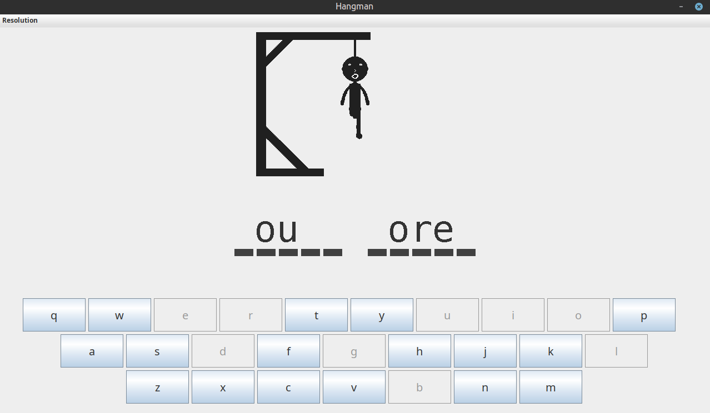
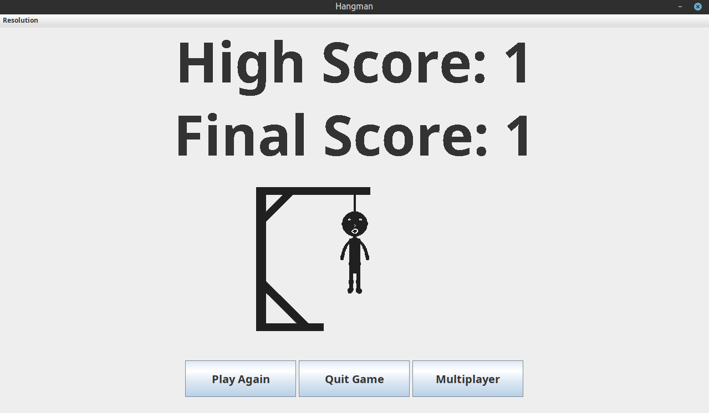
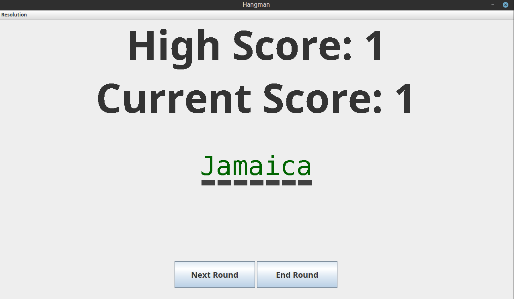
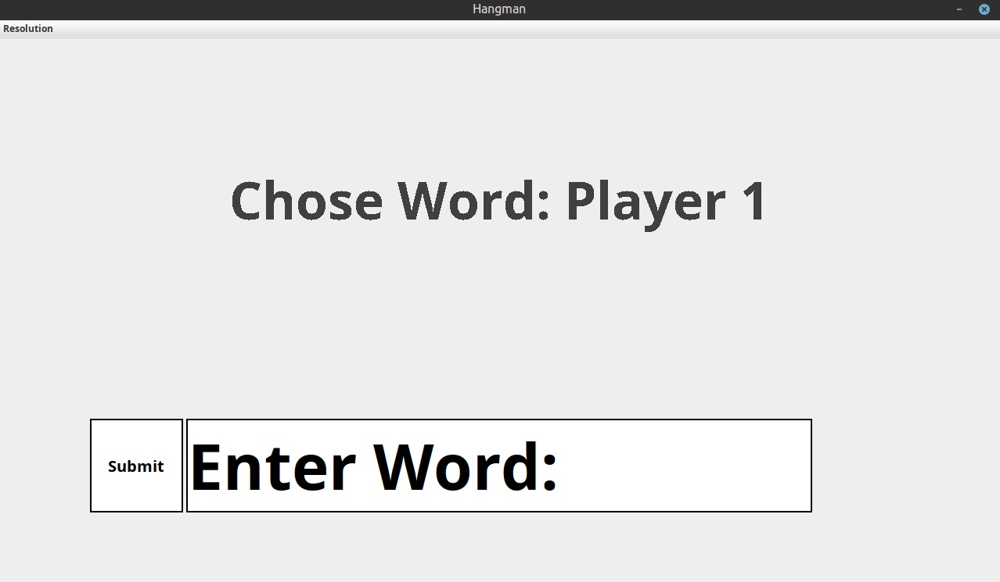

# Hangman - countries of the world edition

The game, built in Java, features a GUI with graphics, random country selection from a text file of words, a high score system
and multiplayer and single player game modes.

Single player generates a random word from the wordLibrary.txt file and gives the player 6 guesses to guess the word.
If they are correct, the score goes up, if not, it is reset. Try to beat your previous high score.

Multiplayer gives 2 players the opportunity to pick a word, and their opponent must guess it, then they swap.
If one player guesses while the other doesn't, they win. Words must be valid and can only contain letters, 
no spaces, checked against the validWords.txt
file of 370,000 words.

To run the game, download the zip file from github and extract the file, then run the jar file.

You can change the resolution between presets using the dropdown menu bar.

Enjoy.

## Screenshots

*Guess the word correctly before the man is hung.*

*Try to beat your highscore*

*Play as many rounds as you like*

*Play with a friend in multiplayer mode*